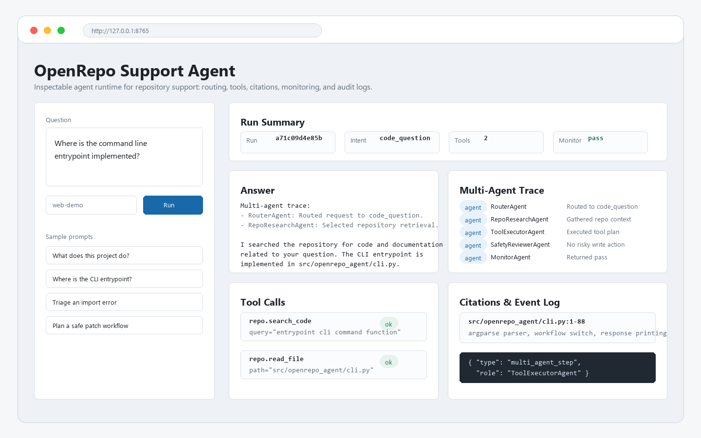
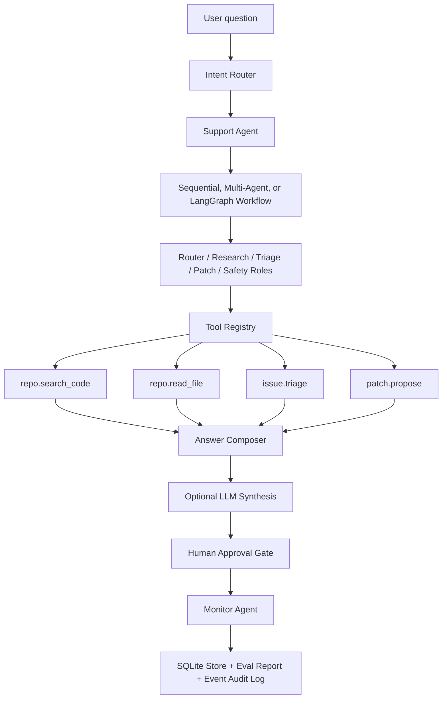

# OpenRepo Support Agent

[](https://www.python.org/)
[](#evaluation)
[](#evaluation)

An end-to-end agent system for open-source project support. It indexes a local
repository, routes user intent, calls MCP-style tools, keeps an auditable event
log, and answers with file citations.

This is built as a portfolio-grade agent runtime, not a one-prompt chatbot. The
core path is deterministic and inspectable, while the multi-agent workflow,
LangGraph, and DeepSeek are optional layers.

Real LLM calls are optional. The default mode is deterministic and works
without an API key. If `DEEPSEEK_API_KEY` is set, the CLI can use DeepSeek to
enhance the final answer while keeping the same tool and audit trail.



## Demo Preview

The local Web Demo turns each run into an inspectable trace. It shows the
detected intent, multi-agent role decisions, MCP-style tool calls, file
citations, monitor status, and raw event log.

Three-minute walkthrough:

```bash
cd openrepo-support-agent
python -m pip install -e .
openrepo-agent-web --repo .
```

Open `http://127.0.0.1:8765` and ask:

```text
Where is the command line entrypoint implemented?
```

Expected surface:

- intent: `code_question`
- roles: RouterAgent, RepoResearchAgent, ToolExecutorAgent,
  SafetyReviewerAgent, MonitorAgent
- tools: `repo.search_code`, `repo.read_file`
- citations: file paths and line ranges from the indexed repository
- monitor: pass/fail status for answer quality and trace integrity

## Why This Project

Open-source support is a realistic agent scenario: users ask setup questions,
report errors, request issue triage, and sometimes need code-aware patch
guidance. A useful support agent needs more than RAG:

- intent routing across support, code, bug, issue, and patch workflows
- repo-aware retrieval with file citations
- multi-turn memory for user environment, errors, and attempted commands
- approval gates for risky tools
- evaluation that measures routing, retrieval, answer checks, tools, and monitor
  findings

This is not a plain RAG chatbot. Retrieval is only one tool in a larger runtime:
the agent routes intent, executes typed tools, records an audit trail, preserves
session memory, gates risky writes through approval, and evaluates each run with
task-level metrics.

## Optional Real LLM Synthesis

The default runtime is deterministic, so tests, demos, and benchmark runs work
without network access or API keys. When `DEEPSEEK_API_KEY` is configured,
OpenRepo can call a DeepSeek/OpenAI-compatible endpoint for final answer
synthesis:

```bash
python -m pip install -e ".[llm]"
$env:DEEPSEEK_API_KEY="sk-..."
python -m openrepo_agent.cli --repo . --use-llm \
  "How do I install and run this project?"
```

The LLM receives bounded tool context and the deterministic fallback answer. It
does not replace routing, tool execution, citations, approval gates, monitoring,
or evaluation. Successful LLM calls are recorded as `llm_enhanced_answer` events;
failed calls fall back to the deterministic answer and record `llm_error`.

See [LLM demo](docs/llm_demo.md) and
[sanitized sample output](examples/deepseek_llm_demo_output.json).

## Current Results

Hardened benchmark: `benchmarks/openrepo_support_tasks.jsonl`

| Metric | Value |
|---|---:|
| Tasks | 20 |
| Intent accuracy | 100.00% |
| Tool success rate | 100.00% |
| Citation coverage | 100.00% |
| Retrieval hit rate | 100.00% |
| Answer check pass rate | 100.00% |
| Monitor pass rate | 100.00% |
| Expected failure detection rate | 0.00% |
| Average tool calls | 1.85 |

Negative-case benchmark: `benchmarks/openrepo_negative_cases.jsonl`

| Metric | Value |
|---|---:|
| Tasks | 5 |
| Intent accuracy | 80.00% |
| Retrieval hit rate | 40.00% |
| Answer check pass rate | 40.00% |
| Monitor pass rate | 80.00% |
| Expected failure detection rate | 100.00% |

The negative-case suite intentionally includes wrong labels, impossible file
targets, mismatched citation expectations, and missing rubric terms. It is used
to verify that the evaluator can identify failure categories such as
`intent_mismatch`, `retrieval_miss`, and `answer_check_failed`.

## Features

- Repo indexing for README, docs, source code, config, and tests
- Intent routing for project overview, setup, code questions, bug reports,
  issue triage, and patch requests
- Local Web Demo for intent, role trace, tool calls, citations, monitor status,
  and event log inspection
- MCP-style `ToolRegistry` with typed tool inputs and consistent outputs
- Code search, file reading, issue triage, and patch suggestion tools
- Event audit log for every route decision and tool call
- Evaluation runner for end-to-end support tasks
- Negative-case benchmark for failure detection and attribution
- Rule-based monitor for failed-session attribution
- Multi-agent workflow with router, repository researcher, issue triage,
  patch planner, safety reviewer, and monitor roles
- Optional LangGraph workflow runtime
- Optional DeepSeek/OpenAI-compatible LLM answer enhancement
- SQLite-backed sessions, turns, event logs, and memory items
- Conversation memory for user environment, errors, and attempted commands
- Human approval workflow for risky tools such as file writes
- CLI demo that can run against any local repository

## Quick Start

```bash
cd openrepo-support-agent
python -m pip install -e .
python -m openrepo_agent.cli --repo . "What does this project do?"
python -m openrepo_agent.cli --repo . "Where is the command line entrypoint?"
python -m openrepo_agent.cli --repo . "I get an import error when running the CLI. Triage this issue."
```

The CLI prints the detected intent, answer, citations, tool calls, and audit
events. By default it writes run logs to `.openrepo-agent/runs/`.

## Demo

Launch the local Web Demo:

```bash
openrepo-agent-web --repo .
```

Then open `http://127.0.0.1:8765`. The page runs the multi-agent workflow by
default and shows:

- detected intent
- role-by-role multi-agent trace
- MCP-style tool calls and outputs
- file citations
- monitor status
- raw event log for auditability

If the package is not installed yet, run `python -m pip install -e .` first.
For quick source-tree testing, use `PYTHONPATH=src python -m openrepo_agent.web --repo .`
on macOS/Linux or `$env:PYTHONPATH="src"; python -m openrepo_agent.web --repo .`
on Windows PowerShell.

Code-aware question:

```bash
python -m openrepo_agent.cli --repo . \
  "Where is the command line entrypoint implemented?"
```

Expected behavior:

- routes to `code_question`
- calls `repo.search_code`
- detects and reads `src/openrepo_agent/cli.py`
- returns citations for the relevant files

Multi-turn memory:

```bash
python -m openrepo_agent.cli --repo . --session-id demo --show-memory \
  "On Windows with Python 3.12 I get ModuleNotFoundError"
python -m openrepo_agent.cli --repo . --session-id demo --show-memory \
  "I already tried python -m openrepo_agent.cli. What should I check next?"
```

Approval-gated write:

```bash
python -m openrepo_agent.cli --repo . --session-id demo \
  "Please create a patch note file for this safe patch workflow"
python -m openrepo_agent.cli --repo . --session-id demo --list-approvals
python -m openrepo_agent.cli --repo . --approve 1
```

Run through LangGraph:

```bash
python -m openrepo_agent.cli --repo . --workflow langgraph "Where is the command line entrypoint?"
```

Run the role-based multi-agent workflow:

```bash
python -m openrepo_agent.cli --repo . --workflow multi_agent \
  "Where is the command line entrypoint implemented?"
```

This prints the same answer/citation surface while the event log records each
role decision as `multi_agent_step`.

Use DeepSeek for the final answer synthesis:

```bash
$env:DEEPSEEK_API_KEY="sk-..."
python -m openrepo_agent.cli --repo . --use-llm "How do I install and run this project?"
```

Do not commit real API keys. Use `.env.example` as the template.

Persist a multi-turn support session:

```bash
python -m openrepo_agent.cli --repo . --session-id demo \
  --show-memory "On Windows with Python 3.12 I get ModuleNotFoundError"
python -m openrepo_agent.cli --repo . --session-id demo \
  --show-memory "I already tried python -m openrepo_agent.cli. What should I check next?"
```

Session data is stored in `.openrepo-agent/openrepo.sqlite` by default.

Create and approve a safe write action:

```bash
python -m openrepo_agent.cli --repo . --session-id demo \
  "Please create a patch note file for this safe patch workflow"
python -m openrepo_agent.cli --repo . --session-id demo --list-approvals
python -m openrepo_agent.cli --repo . --approve 1
```

Patch requests can create pending approvals, but file writes do not execute
until an explicit approval command runs.

Run the end-to-end evaluation suite:

```bash
python -m openrepo_agent.eval.runner --repo . --tasks benchmarks/openrepo_support_tasks.jsonl
```

The evaluator reports intent accuracy, tool success rate, citation coverage,
retrieval hit rate, answer check pass rate, monitor pass rate, and average tool
calls. It writes a detailed JSON report to `.openrepo-agent/eval_report.json`.

See the current summary in `docs/eval_report.md`.

## Architecture



The default path uses deterministic routing and retrieval so behavior is
inspectable. The multi-agent workflow keeps the same tools but records explicit
role decisions:

- RouterAgent routes the request.
- RepoResearchAgent gathers repository context and citations.
- IssueTriageAgent handles setup, bug, and issue classification.
- PatchPlannerAgent prepares patch proposals without writing files.
- SafetyReviewerAgent checks whether risky tools need approval.
- MonitorAgent inspects the final response and event trail.

The optional LangGraph workflow uses the same primitives:

- Router node
- Planner node
- Tool execution node
- Human approval node
- Monitor node
- Evaluation node

The current code supports `--workflow multi_agent` and `--workflow langgraph`.
The sequential path remains the default so tests and demos are reproducible.

## Evaluation

The benchmark task file is JSONL:

```json
{"id":"setup-001","question":"How do I install and run this project locally?","expected_intent":"setup_help"}
```

Each run records:

- expected vs actual intent
- expected files vs cited files
- required answer terms vs matched answer terms
- expected vs detected failure categories for negative cases
- tool calls and tool success rate
- citation count
- monitor status
- failure categories such as `intent_mismatch`, `tool_error`, and
  `missing_citation`, `retrieval_miss`, and `answer_check_failed`

This makes the project easier to discuss in interviews: the agent is not only
able to answer, it can also measure and explain where it fails.

## What Makes It Non-Toy

- Hidden benchmark labels live under `benchmarks/`, and the indexer ignores
  them to avoid evaluation contamination.
- Long-term memory is extracted only from user input, not retrieved snippets or
  generated answers.
- Risky tools create pending approvals instead of mutating files silently.
- The default runtime is deterministic, so tests and benchmark runs are
  reproducible without API keys.
- Optional LLM synthesis is bounded by tool context and does not replace the
  explicit runtime steps.

## Documentation

- [Demo script](docs/demo.md)
- [Architecture](docs/architecture.md)
- [Evaluation](docs/evaluation.md)
- [Evaluation report](docs/eval_report.md)
- [LLM demo](docs/llm_demo.md)
- [Persistence and memory](docs/persistence.md)
- [Roadmap](docs/roadmap.md)

## Project Layout

```text
openrepo-support-agent/
  src/openrepo_agent/
    agent.py
    cli.py
    web.py
    events.py
    indexer.py
    intent.py
    llm.py
    memory.py
    models.py
    monitor.py
    storage.py
    workflow.py
    eval/
      metrics.py
      runner.py
    tools/
      registry.py
      repo_tools.py
  docs/
    assets/
      demo-preview.png
    architecture.md
    evaluation.md
    eval_report.md
    llm_demo.md
    persistence.md
    roadmap.md
  examples/
    deepseek_llm_demo_output.json
  benchmarks/
    openrepo_support_tasks.jsonl
    openrepo_negative_cases.jsonl
  tests/
```

## Design Notes

The project is built around a simple rule: an agent system should be observable
before it is clever. Every route decision and tool call is logged with inputs,
outputs, and citations. This makes later evaluation and monitoring possible.
Long-term memory is extracted only from user-provided text, not retrieved
answer context, to avoid contaminating memory with snippets from the repo.
Risky tools use pending approvals, so the agent can propose actions without
silently mutating the repository.

## Roadmap

- Add command execution with approval and sandbox policy
- Add FastAPI service and minimal web UI
- Expand benchmark to 30+ tasks with harder negative cases
